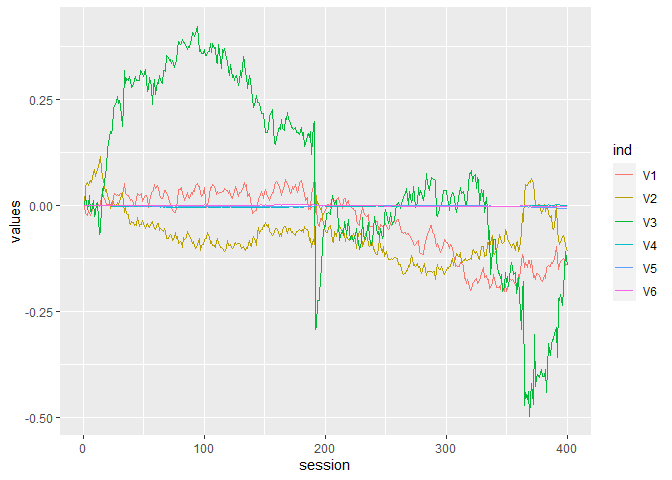
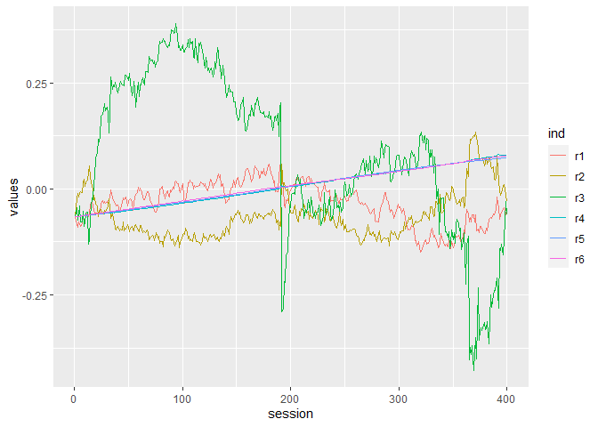
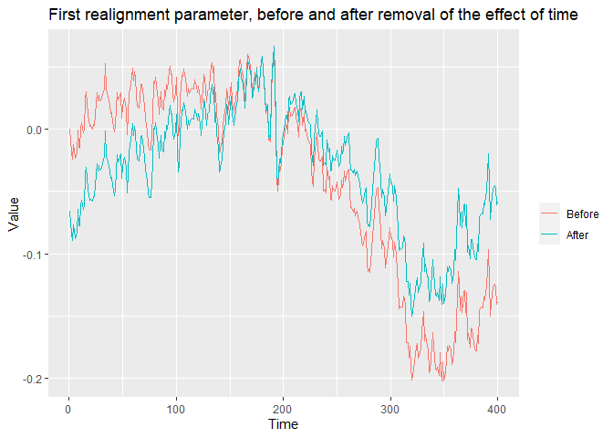

Assignment III
================
Dana Jensen
February 17, 2017

``` r
# setting working directory and loading data, packages etc.
setwd("C:\\Users\\danaj\\Documents\\GitHub\\Statistical_Methods_2")
library(pacman)
p_load(psych, ggplot2)

parametres = read.table("parametres.txt", header = FALSE)
fmri<-as.matrix(read.csv("aud_fmri_data37.csv", header = FALSE))
fmri2<-ts(fmri)
fmrides<-as.matrix(read.csv("aud_fmri_design.csv", header = FALSE))
fmrides2<-ts(fmrides)
```

Import the realignment parameters into R. Make a lineplot of the
realignment parameters in R.

``` r
# making a dataframe
parametres$Session = c(1:400)
lineplotdata <- stack(parametres, c(V1, V2, V3, V4, V5, V6)) 
lineplotdata$session = c(1:400, 1:400, 1:400, 1:400, 1:400, 1:400)

# lineplot of the realignment parameters
lineplot <- ggplot(lineplotdata, aes(session, values, group = ind, colour = ind)) + geom_line()

#lineplot of realignment parametres
lineplot
```

<!-- -->

How far has the participant moved for each dimension during the
experiment (Hint: use “apply()” to run a function across columns)?

``` r
# finding the range of how far the participant moved
# 2 indicates rows, a 1 would indicate columns
ranges = apply(parametres, 2, range)
ranges1 = ranges[1,-7] - ranges[2,-7]

# length of movement
print(round(ranges1, 2))
```

    ##    V1    V2    V3    V4    V5    V6 
    ## -0.26 -0.29 -0.92 -0.01 -0.01 -0.01

``` r
# sum of dimensions 1:3 vs 4:6
sum(ranges1[1:3])
```

    ## [1] -1.470805

``` r
sum(ranges1[4:6])
```

    ## [1] -0.02121322

There was more movement in the first three dimensions compared to the
last three dimensions, -1.47 vs. -0.02.

Are any of the realignment parameters significantly correlated with the
fMRI model?

``` r
# converting to dataframe
fmrides<-data.frame(fmrides)

# testing for correlation
psych::corr.test(parametres,fmrides)
```

    ## Call:psych::corr.test(x = parametres, y = fmrides)
    ## Correlation matrix 
    ##            V1    V2
    ## V1      -0.03  0.01
    ## V2      -0.01  0.02
    ## V3       0.02  0.03
    ## V4      -0.09  0.01
    ## V5       0.17  0.02
    ## V6      -0.03  0.03
    ## Session -0.02 -0.06
    ## Sample Size 
    ## [1] 400
    ## These are the unadjusted probability values.
    ##   The probability values  adjusted for multiple tests are in the p.adj object. 
    ##           V1   V2
    ## V1      0.58 0.90
    ## V2      0.80 0.70
    ## V3      0.62 0.49
    ## V4      0.07 0.86
    ## V5      0.00 0.63
    ## V6      0.55 0.59
    ## Session 0.65 0.25
    ## 
    ##  To see confidence intervals of the correlations, print with the short=FALSE option

V1, the first story, and V5, one of the dimensions of the fMRI, are
significantly correlated: r= 0.17, p\<.05

Remove linear effects of time from the realignment parameters (hint: fit
a line and use residuals).

``` r
# fitting a linear model to the data to find residuals
model = lm(values ~ session, lineplotdata)
summary(model)
```

    ## 
    ## Call:
    ## lm(formula = values ~ session, data = lineplotdata)
    ## 
    ## Residuals:
    ##      Min       1Q   Median       3Q      Max 
    ## -0.42711 -0.05423 -0.00961  0.03972  0.38945 
    ## 
    ## Coefficients:
    ##               Estimate Std. Error t value Pr(>|t|)    
    ## (Intercept)  6.639e-02  3.947e-03   16.82   <2e-16 ***
    ## session     -3.670e-04  1.706e-05  -21.51   <2e-16 ***
    ## ---
    ## Signif. codes:  0 '***' 0.001 '**' 0.01 '*' 0.05 '.' 0.1 ' ' 1
    ## 
    ## Residual standard error: 0.09651 on 2398 degrees of freedom
    ## Multiple R-squared:  0.1618, Adjusted R-squared:  0.1614 
    ## F-statistic: 462.7 on 1 and 2398 DF,  p-value: < 2.2e-16

``` r
# extracting residuals for each dimension
r1 = model$residuals[lineplotdata$ind == "V1"]
r2 = model$residuals[lineplotdata$ind == "V2"]
r3 = model$residuals[lineplotdata$ind == "V3"]
r4 = model$residuals[lineplotdata$ind == "V4"]
r5 = model$residuals[lineplotdata$ind == "V5"]
r6 = model$residuals[lineplotdata$ind == "V6"]

# saving into dataframe
residuals1 = data.frame(r1,r2,r3,r4,r5,r6)
```

Make a lineplot of the realignment parameters with time removed.

``` r
# lineplot of residuals
lineplot2data <- stack(residuals1, c(r1,r2,r3,r4,r5,r6))
lineplot2data$session = c(1:400, 1:400, 1:400, 1:400, 1:400, 1:400)
lineplot2 <- ggplot(lineplot2data, aes(session, values, group = ind, colour = ind)) +
  geom_line()

# lineplot parametres with time removed
lineplot2
```

<!-- -->

Make a lineplot including only the first realignment parameter before
and after removal.

``` r
# defining before and after residual removal
After = model$residuals[lineplotdata$ind == "V1"]
Before = parametres[,1]

# constructing a lineplot
lineplot3data = data.frame(Before, After)
lineplot3data <- stack(lineplot3data, c(Before, After))
lineplot3data$session = c(1:400)
lineplot3 <- ggplot(lineplot3data, aes(session, values, group = ind, colour = ind)) +
  labs(title = "First realignment parameter, before and after removal of the effect of time", x= "Time", y = "Value", colour = "") + 
  geom_line()

# lineplot before and after removal of time effect
lineplot3
```

<!-- -->

Are the realignment parameters (corrected for effects of time) now
correlated with the fMRI model?

``` r
# testing for correlation
corr.test(residuals1, fmrides)
```

    ## Call:corr.test(x = residuals1, y = fmrides)
    ## Correlation matrix 
    ##       V1    V2
    ## r1 -0.06 -0.04
    ## r2 -0.03 -0.03
    ## r3  0.02  0.03
    ## r4 -0.03 -0.06
    ## r5 -0.02 -0.06
    ## r6 -0.02 -0.06
    ## Sample Size 
    ## [1] 400
    ## These are the unadjusted probability values.
    ##   The probability values  adjusted for multiple tests are in the p.adj object. 
    ##      V1   V2
    ## r1 0.20 0.42
    ## r2 0.54 0.61
    ## r3 0.64 0.59
    ## r4 0.61 0.26
    ## r5 0.73 0.25
    ## r6 0.63 0.24
    ## 
    ##  To see confidence intervals of the correlations, print with the short=FALSE option

No, none of the realignment parametres are correlated with the fMRI
model, p=1
