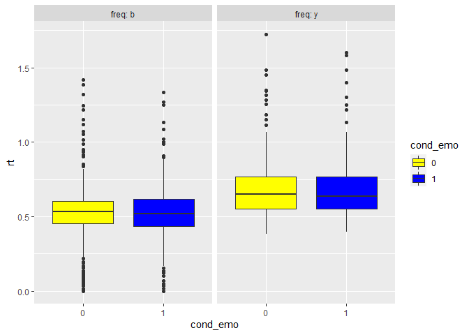
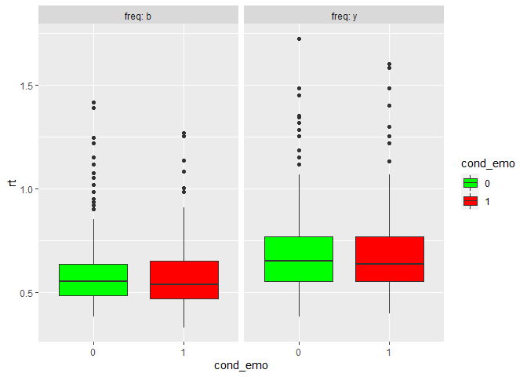
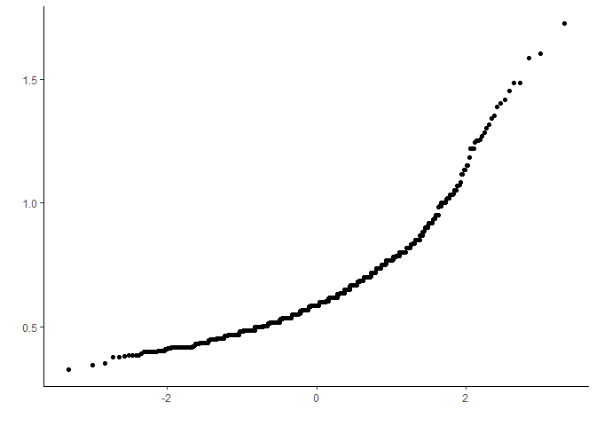
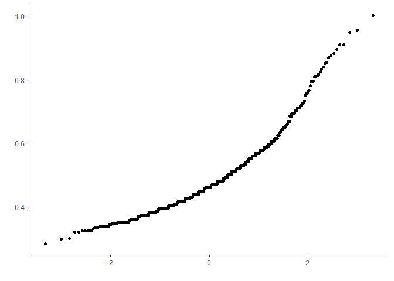
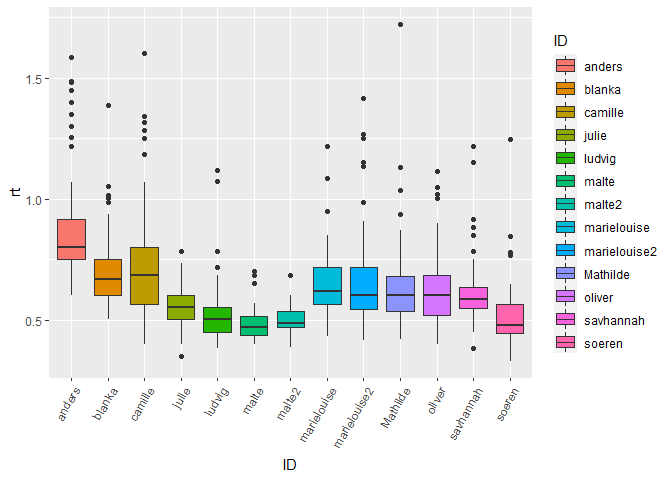

Assignment VI
================
Dana Jensen
March 10, 2017

Assignment Tasks

1.  Comprehension 1a: Please explain which factor was
    between-participants and which were within-participants and why.

-   The within-participant effect is emotion (neutral and fearful). This
    is a within-participant factor because they do not vary between
    participants, and each participant has the same experience. The
    between-participant factor is colour (blue and yellow). This is
    because the factor varies over participants, creating two
    conditions. Therefore, the multiple effects to be analysed are
    colours, colour frequency, and emotion.

2.  Data exploring and preparation.

Find the data on blackboard. Load the data using somehting like the
following code:

``` r
setwd("C:\\Users\\danaj\\Documents\\GitHub\\Statistical_Methods_2")
face_exp<-read.csv("face_exp_data_all.csv", sep=";") #conditions are coded in the "cond_blue", "cond_emo" and "freq" variables
library(pacman)
p_load(ggplot2, pastecs, nlme, car)
```

Make sure that factorial variables are coded as factors using the
as.factor() function.

``` r
#setting variables as factors
face_exp$cond_emo = as.factor(face_exp$cond_emo)
face_exp$freq = as.factor(face_exp$freq)
```

2.a.: Make a box-plot of the data with RT on the y-axix and emotional
condition on the x-axis with colour being coded as “fill” colour. Plot
the two different frequency groups using “facet_wrap(\~freq,
labeller=label_both) in ggplot (e.g. see student resources for Field,
chapter 14). Make the boxes appear in appropriate colours, e.g. using” +
scale_fill_manual(values =
c(“yellow”,“blue”,“yellow”,“blue”,“yellow”,“blue”,“yellow”,“blue”))“.

``` r
#box plot depicting the four different conditions (freq= b,y; cond.emo= 0,1)
plot <- ggplot(face_exp, aes(cond_emo, rt, fill = cond_emo)) + 
  geom_boxplot() + 
  facet_wrap(~freq, labeller=label_both) +
  scale_fill_manual(values=c("yellow","blue","yellow","blue","yellow","blue","yellow","blue"))

plot
```

    ## Warning: Removed 3 rows containing non-finite values (stat_boxplot).

<!-- -->

2.b Explain why this plot shows that there is something wrong with the
data.

-   First of all, there are a lot of outliers in the data across the
    conditions (0 and 1). This can be seen by the many dots on the
    ‘whiskers’ of the box plots. Second of all, there seems to be no
    difference between the frequency conditions. For each frequency
    condition, the two emotion variables have close to the same mean and
    distrobution. Finally, there are a lot of reaction time values
    around zero in the “b” frequency condition. This is caused by the
    “t” indication for the fmri, which then records at zero. This
    appears corrected for the second “y” condition.

2.c.: Make a subset of the data, including only correct responses.

``` r
# Making a subset with only the correct responses 
face_expSub = subset(face_exp, correct_resp == 1)
```

2.d.: Make another boxplot similar to that in 2.a.

``` r
#another box plot without outliers
plot2 <- ggplot(face_expSub, aes(cond_emo, rt, fill = cond_emo)) + 
  geom_boxplot() + 
  facet_wrap(~freq, labeller=label_both) +
  scale_fill_manual(values=c("green","red","green","red","green","red","green","red"))

plot2
```

<!-- -->

2.e.: Use the by() function and stat.desc (in library(pastecs)) to get
descriptive measures for the different conditions.

``` r
#producing descriptive statistics

emo <- by(face_expSub, face_expSub$cond_emo, stat.desc, basic = FALSE)
blue <- by(face_expSub, face_expSub$cond_blue, stat.desc, basic = FALSE)
```

-   The blue frequency condition has a mean of 0.58 and a standard
    deviation of 0.15.
-   The yellow frequency condition has a mean of 0.69 and a standard
    deviation of 0.20.

2.f.: Explore if the data is normally distributed using a qq-plot
(qqp()).

``` r
# creating a qq plot to test normality distribution
p1 <- qplot(sample = face_expSub$rt, stat= "qq")+
  theme_classic()
```

    ## Warning: `stat` is deprecated

``` r
p1
```

<!-- -->

-   The data do not appear to be in a linear formation, rather they are
    curved, indicating the data is not normally distributed.

2.g.: log-transform the data.

``` r
# log transforming the data (taking log of each value). +1 for values of zero
face_expSub$logrt <- log(face_expSub$rt + 1)
```

2.h.: Use a qq-plot to explore if the transformed data appear more
normal than the untransformed.

``` r
#yet another qq plot to see if the log transformation fixed the normality problem
p2 <- qplot(sample = face_expSub$logrt, stat= "qq")+
  theme_classic()
```

    ## Warning: `stat` is deprecated

``` r
p2
```

<!-- -->

-   The data slightly is more normalised, however the data still appears
    to be curved.

2.i.: Explore the response times for each participant, individually,
using a box-plot.

``` r
#box plot for each participant
rtplot <- ggplot(face_expSub, aes(ID, rt, fill = ID)) + 
  geom_boxplot() + 
  theme(axis.text.x = element_text(angle = 60, hjust = 1))

rtplot
```

<!-- -->

-   None of the data seem to be skewed (all boxes have both “whiskers”).
    However, there seems to be a lot of outliers for the individual
    participants.There is also variation in the range between
    participants.

3.  Data analysis 3.a.: Make a mixed-effects model using the lme() or
    lmer() function, including the three factors as fixed effects and
    participants as random effects. Include 2-way and 3-way
    interactions. Use maximum-likelihood as estimation method
    (method=“ML”).

``` r
#Using a multi-level model to compute a mixed-effects model
model1<-lme(rt ~ freq + 
              cond_emo + 
              cond_blue + 
              freq:cond_emo + 
              freq:cond_blue + 
              cond_emo:cond_blue + 
              freq:cond_emo:cond_blue, 
            random = ~1|ID, 
            method = "ML", 
            data = face_expSub)
```

3.b.: Report the t-statistics using summary().

``` r
summary(model1)
```

    ## Linear mixed-effects model fit by maximum likelihood
    ##   Data: face_expSub 
    ##         AIC       BIC   logLik
    ##   -974.6589 -924.8302 497.3294
    ## 
    ## Random effects:
    ##  Formula: ~1 | ID
    ##         (Intercept)  Residual
    ## StdDev:  0.08292331 0.1495741
    ## 
    ## Fixed effects:  rt ~ freq + cond_emo + cond_blue + freq:cond_emo + freq:cond_blue +      cond_emo:cond_blue + freq:cond_emo:cond_blue 
    ##                                Value  Std.Error   DF   t-value p-value
    ## (Intercept)                0.6001527 0.03336455 1059 17.987736  0.0000
    ## freqy                      0.0983278 0.05139453   11  1.913197  0.0821
    ## cond_emo1                 -0.0360942 0.02198441 1059 -1.641808  0.1009
    ## cond_blue                 -0.0382906 0.01878933 1059 -2.037888  0.0418
    ## freqy:cond_emo1            0.0175611 0.02772445 1059  0.633414  0.5266
    ## freqy:cond_blue            0.0349247 0.02788283 1059  1.252551  0.2106
    ## cond_emo1:cond_blue        0.0430682 0.02646676 1059  1.627255  0.1040
    ## freqy:cond_emo1:cond_blue -0.0297707 0.03940744 1059 -0.755459  0.4501
    ##  Correlation: 
    ##                           (Intr) freqy  cnd_m1 cnd_bl frq:_1 frqy:_ cn_1:_
    ## freqy                     -0.649                                          
    ## cond_emo1                 -0.335  0.218                                   
    ## cond_blue                 -0.392  0.255  0.594                            
    ## freqy:cond_emo1            0.266 -0.273 -0.793 -0.471                     
    ## freqy:cond_blue            0.264 -0.271 -0.400 -0.674  0.502              
    ## cond_emo1:cond_blue        0.277 -0.180 -0.830 -0.708  0.658  0.477       
    ## freqy:cond_emo1:cond_blue -0.186  0.191  0.557  0.476 -0.703 -0.707 -0.672
    ## 
    ## Standardized Within-Group Residuals:
    ##        Min         Q1        Med         Q3        Max 
    ## -2.0934030 -0.5797357 -0.1653201  0.3122575  7.2232283 
    ## 
    ## Number of Observations: 1078
    ## Number of Groups: 13

-   Only one of the variables (blue condition) turned out to be a
    significant predictor of reaction time, t(1059)= -2.04, p= .041.

3.c.: Report the F-statistics using anova() Which gives you type=‘I’
analysis.

``` r
#running anova to get F statistic with type I analysis
anova(model1)
```

    ##                         numDF denDF  F-value p-value
    ## (Intercept)                 1  1059 686.2078  <.0001
    ## freq                        1    11   6.1539  0.0305
    ## cond_emo                    1  1059   1.1158  0.2911
    ## cond_blue                   1  1059   0.6096  0.4351
    ## freq:cond_emo               1  1059   0.1803  0.6712
    ## freq:cond_blue              1  1059   1.0169  0.3135
    ## cond_emo:cond_blue          1  1059   2.2847  0.1310
    ## freq:cond_emo:cond_blue     1  1059   0.5707  0.4501

3.d.: Report the F-statistics using library(car) Anova() and type=‘III’.
Why might there be differences between results from 3.c and 3.d?

``` r
#anova with type III analysis
Anova(model1, type = "III")
```

    ## Analysis of Deviance Table (Type III tests)
    ## 
    ## Response: rt
    ##                            Chisq Df Pr(>Chisq)    
    ## (Intercept)             325.9778  1    < 2e-16 ***
    ## freq                      3.6877  1    0.05482 .  
    ## cond_emo                  2.7157  1    0.09937 .  
    ## cond_blue                 4.1840  1    0.04081 *  
    ## freq:cond_emo             0.4042  1    0.52492    
    ## freq:cond_blue            1.5806  1    0.20867    
    ## cond_emo:cond_blue        2.6678  1    0.10240    
    ## freq:cond_emo:cond_blue   0.5750  1    0.44828    
    ## ---
    ## Signif. codes:  0 '***' 0.001 '**' 0.01 '*' 0.05 '.' 0.1 ' ' 1

-   For type I analysis, the variance is explained using the first
    chronological variable. All variables following are not analysed
    independently, meaning that the variance is only attributed to the
    first variable.This is why in the output for the type I analysis,
    only frequency (the first variable) is significant. On the other
    hand, type III compensates for multiple variables, and therefore
    individually analyses the variables, while taking into account all
    other variables. This means that the variance that may have only
    been attributed to first variable in the Type I is now spread to
    variance explained by multiple variables. This is why the Type III
    output has multiple significant variables.

3.e.: Make a new model including a random slope from trial number (‘no’
in the log-file). Repeat 3.b. Did it change the results?

``` r
# random slope model
newModel<-lme(rt ~ freq + 
                cond_emo + 
                cond_blue + 
                freq:cond_emo + 
                freq:cond_blue + 
                cond_emo:cond_blue + 
                freq:cond_emo:cond_blue, 
              random = ~no|ID, 
              method = "ML", 
              data = face_expSub)

summary(newModel)
```

    ## Linear mixed-effects model fit by maximum likelihood
    ##   Data: face_expSub 
    ##         AIC       BIC   logLik
    ##   -992.1536 -932.3593 508.0768
    ## 
    ## Random effects:
    ##  Formula: ~no | ID
    ##  Structure: General positive-definite, Log-Cholesky parametrization
    ##             StdDev      Corr  
    ## (Intercept) 0.088611443 (Intr)
    ## no          0.001013257 -0.381
    ## Residual    0.146834795       
    ## 
    ## Fixed effects:  rt ~ freq + cond_emo + cond_blue + freq:cond_emo + freq:cond_blue +      cond_emo:cond_blue + freq:cond_emo:cond_blue 
    ##                                Value  Std.Error   DF   t-value p-value
    ## (Intercept)                0.5931595 0.03304925 1059 17.947743  0.0000
    ## freqy                      0.1030098 0.05090884   11  2.023417  0.0680
    ## cond_emo1                 -0.0354775 0.02165513 1059 -1.638293  0.1017
    ## cond_blue                 -0.0366584 0.01850889 1059 -1.980585  0.0479
    ## freqy:cond_emo1            0.0142191 0.02730346 1059  0.520780  0.6026
    ## freqy:cond_blue            0.0294626 0.02748084 1059  1.072114  0.2839
    ## cond_emo1:cond_blue        0.0442311 0.02606765 1059  1.696781  0.0900
    ## freqy:cond_emo1:cond_blue -0.0320250 0.03882038 1059 -0.824952  0.4096
    ##  Correlation: 
    ##                           (Intr) freqy  cnd_m1 cnd_bl frq:_1 frqy:_ cn_1:_
    ## freqy                     -0.649                                          
    ## cond_emo1                 -0.330  0.214                                   
    ## cond_blue                 -0.392  0.255  0.592                            
    ## freqy:cond_emo1            0.262 -0.269 -0.793 -0.469                     
    ## freqy:cond_blue            0.264 -0.270 -0.398 -0.674  0.498              
    ## cond_emo1:cond_blue        0.276 -0.179 -0.829 -0.707  0.657  0.476       
    ## freqy:cond_emo1:cond_blue -0.185  0.192  0.557  0.475 -0.701 -0.706 -0.671
    ## 
    ## Standardized Within-Group Residuals:
    ##        Min         Q1        Med         Q3        Max 
    ## -1.8104800 -0.5746993 -0.1577360  0.2951566  7.3049584 
    ## 
    ## Number of Observations: 1078
    ## Number of Groups: 13

3.f.: Make a model comparison of model 3.a and 3.e using anova(). Did
the inclusion of a random slope significantly improve the model?

``` r
#Comparing fit of the two models
anova(model1, newModel)
```

    ##          Model df       AIC       BIC   logLik   Test  L.Ratio p-value
    ## model1       1 10 -974.6589 -924.8302 497.3294                        
    ## newModel     2 12 -992.1536 -932.3593 508.0768 1 vs 2 21.49476  <.0001

-   The random slopes improved the model, because the log likelihood was
    higher and the AIC was lower (Log likelihood 508.08 versus 497.33,
    AIC -992.15 versus -974.66).

3.g.: Response times are correlated in time. It might therefore be an
idea to include a so-called auto-regressive component in the model
(e.g. this is default in SPM analyses of fMRI-data). In lme(), this is
done by adding the following to the model specification:
“cor=corAR1(,form=\~1\|ID)”. Does that have an effect?

``` r
#adding an auto-regressive component to the model
regressiveModel<-lme(rt ~ freq +
                       cond_emo + 
                       cond_blue + 
                       freq:cond_emo + 
                       freq:cond_blue + 
                       cond_emo:cond_blue + 
                       freq:cond_emo:cond_blue, 
                     random = ~no|ID, method = "ML", 
                     data = face_expSub, 
                     cor = corAR1 (form = ~1|ID))

summary(regressiveModel)
```

    ## Linear mixed-effects model fit by maximum likelihood
    ##   Data: face_expSub 
    ##         AIC       BIC   logLik
    ##   -1007.035 -942.2578 516.5175
    ## 
    ## Random effects:
    ##  Formula: ~no | ID
    ##  Structure: General positive-definite, Log-Cholesky parametrization
    ##             StdDev       Corr  
    ## (Intercept) 0.0864499425 (Intr)
    ## no          0.0009487704 -0.346
    ## Residual    0.1476141527       
    ## 
    ## Correlation Structure: AR(1)
    ##  Formula: ~1 | ID 
    ##  Parameter estimate(s):
    ##       Phi 
    ## 0.1389518 
    ## Fixed effects:  rt ~ freq + cond_emo + cond_blue + freq:cond_emo + freq:cond_blue +      cond_emo:cond_blue + freq:cond_emo:cond_blue 
    ##                                Value  Std.Error   DF   t-value p-value
    ## (Intercept)                0.5950237 0.03288558 1059 18.093760  0.0000
    ## freqy                      0.1061801 0.05070298   11  2.094159  0.0602
    ## cond_emo1                 -0.0392732 0.02123792 1059 -1.849201  0.0647
    ## cond_blue                 -0.0378719 0.01806981 1059 -2.095867  0.0363
    ## freqy:cond_emo1            0.0123062 0.02676059 1059  0.459863  0.6457
    ## freqy:cond_blue            0.0251588 0.02690784 1059  0.934999  0.3500
    ## cond_emo1:cond_blue        0.0495363 0.02557982 1059  1.936537  0.0531
    ## freqy:cond_emo1:cond_blue -0.0286433 0.03780818 1059 -0.757596  0.4489
    ##  Correlation: 
    ##                           (Intr) freqy  cnd_m1 cnd_bl frq:_1 frqy:_ cn_1:_
    ## freqy                     -0.649                                          
    ## cond_emo1                 -0.323  0.209                                   
    ## cond_blue                 -0.384  0.249  0.586                            
    ## freqy:cond_emo1            0.256 -0.263 -0.794 -0.465                     
    ## freqy:cond_blue            0.258 -0.263 -0.394 -0.672  0.491              
    ## cond_emo1:cond_blue        0.268 -0.174 -0.825 -0.704  0.655  0.473       
    ## freqy:cond_emo1:cond_blue -0.182  0.188  0.558  0.476 -0.696 -0.706 -0.677
    ## 
    ## Standardized Within-Group Residuals:
    ##        Min         Q1        Med         Q3        Max 
    ## -1.7593000 -0.5758556 -0.1660874  0.2980550  7.2017187 
    ## 
    ## Number of Observations: 1078
    ## Number of Groups: 13

``` r
anova(newModel, regressiveModel)
```

    ##                 Model df        AIC       BIC   logLik   Test L.Ratio p-value
    ## newModel            1 12  -992.1536 -932.3593 508.0768                       
    ## regressiveModel     2 13 -1007.0350 -942.2578 516.5175 1 vs 2 16.8814  <.0001

Adding an auto regressive improves the model compared to the first nor
the second model (log likelihood is 510.98, AIC is -1007.04)

4.  Results and interpretation. 4.a.: If you were to report these
    results, which model would you use and why?

-   The model we would use would be the regressive model, because it
    leaves the least amount of variance unexplained (the model fits the
    data the best).

4.b.: What are the dangers in the strategy used above?

-   This may result in a “pick and choose” habit, where you analyse the
    data in multiple ways and pick which one gives the results you like
    best. It is better to think about how you are going to analyse the
    data before hand, and decide which model you think would fit the
    best before you carry out the analysis.

4.c. Write a few lines, briefly stating the results of the experiment in
relation to the hypotheses.

-   The first hypothesis is that the blue condition will yield shorter
    reaction times than the yellow condition. The blue condition did
    have a smaller numeric difference of reaction time compared to the
    yellow condition and this difference was significant, b= -0.38,
    t(1059) = -2.1, p=.04.

-   The second hypothesis is that fearful faces will have a shorter
    response time than neutral faces. Emotional faces did not have a
    significant smaller numeric difference in reaction time compared to
    neutral faces, b= -0.04, t(1059)= -1.85, p= .06.

-   The third hypothesis is that infrequent stimuli reveal longer
    responses that frequently presented stimuli. This hypothesis was not
    confirmed, because the interaction between frequency and colour was
    not significant, b= 0.03, t(1059)= 0.94, p= .35. If the interaction
    were significant, it would mean that there would be a significant
    difference in reaction time between the two colours depending on
    which colour was present more or less frequently.
